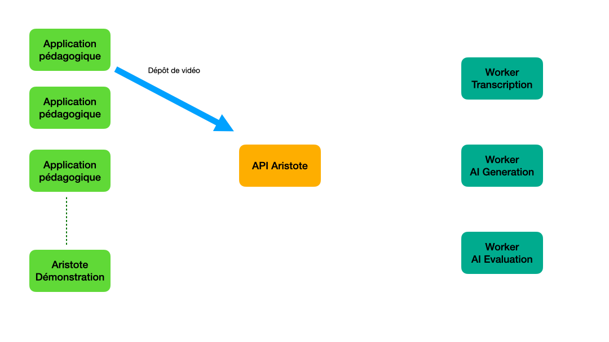

# Bienvenue sur le site de présentation du projet Aristote.

Lors de la conférence IA & Education des 8 et 9 Juin 2023, un [prototype de l'application Aristote](https://webtv.centralesupelec.fr/videos/aristote/) a été présenté.
Il répondait aux attentes des étudiants afin de rendre le média vidéo plus facile à utiliser pour leurs révisions.

{ width="750" }
{:.image-caption}
*Prototype Aristote (Conférence IA & Education 2023)*

Aristote utilise l'IA (intelligence artificielle) afin de transformer des vidéothèques pédagogiques en ressources d'apprentissage enrichies:

- en produisant une retranscription de l'audio sous forme de texte qui peut être synchronisé avec la vidéo et dans lequel les recherches sont facilitées
- en classifiant les vidéos selon des thématiques
- en proposant un titre, une description, des mots clés
- en générant des propositions de questions à choix multiples (QCM) intégrables aux vidéos ou exploitables dans une plateforme d'apprentissage en ligne (comme Moodle)

A terme, d'autres médias que les vidéos pourront être ajoutés (PDF par exemple).

## Objectifs du projet

Ce projet vise à industrialiser la production de ressources pour en faciliter la diffusion afin de:

- faciliter l'adoption de ces technologies par les editeurs via un accès à une interface de programmation Web (API REST)
- proposer une infrastructure mutualisée pour les opérations d'agent IA 
  - cette infrastructure se veut être ouverte afin de permettre à chaque partenaire d'ajouter ses propres ressources de calcul
- produire des données libres d'utilisation par l'usage d'IA non propriétaires aux conditions d'utilisation  plus claires
- capitaliser sur les données produites et captées sous forme de retour utilisateurs: production de banques de ressource, amélioration des IA (fine tuning), développement de nouveaux services basés sur ces données par des EdTech partenaires

## Phases et architecture du projet

Le premier jalon à court terme est d'embarquer un large panel d'enseignants afin de vérifier que l'IA génère des quizz de bonne qualité pour leur discipline.

{ width="750" }
{:.image-caption}
Portail de démonstration Aristote
Nous avons donc implémenté un portail de démonstration qui permettra (dès que l'infrastructure IA sera opérationnelle):

  - de téléverser une vidéo
  - de demander à l'infrastructure d'IA Aristote de générer les données d'enrichissement (retranscription audio, classification par discipline, mots clés, propositions de QCM)
  - d'évaluer la qualité des données produites et de les corriger
 
{ width="750" }
{:.image-caption}
*API Aristote pour les applications pédagogiques*

Ce portail de démonstration s'appuie sur une architecture Webservices (API REST) que nous avons pensé la plus ouverte possible pour faciliter l'intégration d'Aristote par les éditeurs de la EdTech:

  - l'API a été conçue en collaboration avec France Université Numérique et l'équipe du projet ESUP-Pod
  - elle est en cours d'intégration dans POD
  - d'autres éditeurs se sont montrés intéressés pour intégrer Aristote

{ width="750" }
{:.image-caption}
*Principe d'architecture de l'infrastructure Aristote*

Nous avons travaillé sur l'optimisation de la qualité des données générées par l'IA, voici ce qui ressort de nos premières études:

- nous avons choisi le grand modèle de langage openHermes (LLM) pour sa compréhension de la langue Française
- pour améliorer la pertinence des réponses, nous demandons au LLM de générer de nombreuses options pour les QCM, que nous faisons ensuite évaluer par un autre LLM
- actuellement cette évaluation est **optionnellement** réalisée par ChatGPT, mais nous allons continuer à chercher une alternative

Nous avons commencé la création de l'infrastructure d'IA d'Aristote est basée sur des ressources de calcul, sur laquel sont implémentés des `workers` participant à la production de contenus:

  - une API a été implémentée pour permettre de faciliter l'implémentation et l'évolution des `workers` 
  - 3 types de `workers`: transcription (speech to text), IA générative (pour générer les données et QCM) et d'évaluation (faire une sélection sur les propositions de l'IA générative)  
  - cela facilite la mutualisation de capacités de calcul entre les partenaires du projet
 
## Implémentations dans des outils tiers

Aristote est désormais intégré dans la version 3.7 d'ESUP-Pod et sera intégré dans la plateforme Marsha de France Université Numérique.

Nous avons par ailleurs des contacts avec les éditeurs Ubicast, Wiloki et Whaller poir intégrer Aristote dans leur offre.
